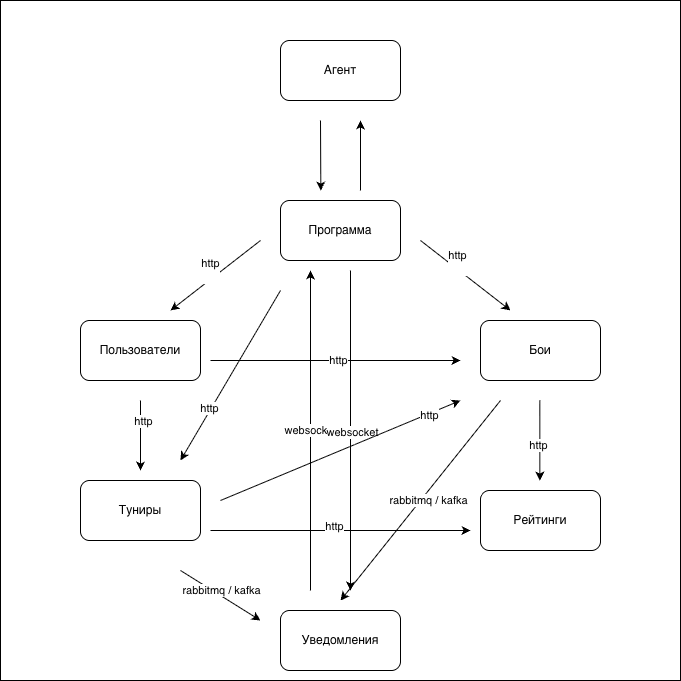

## Описание архитектуры

Архитектура состоит из 1 приложения (агент) и 6ти микросервисов
Сервис программа отвечает за UI, связывающий пользователя и игровые процессы
Сервис пользователи отвечает за регистрацию и аутентификаию игроков
Сервис турниры управляет созданием и проведением турниров, принимает заявки от участников, публикует в очередь сообщения для отправки уведомлений
Сервис бои реализован с использованием redis, чтобы снизить нагрузку на бд, после окончания боя отправляет запрос на перерасчет рейтингов, публикуя сообщение в очередь, чтобы операция была атомарной, используется паттерн сага
Сервис рейтинги перерасчитывает рейтинги по окончании боев, подписан на события из очереди
сервис уведомления доставляет через websocket уведомления игрокам, подписан на события из очереди

## Endpoints

### Пользователи
- Пользователи зарегистрироваться - `POST /api/auth/register`
- Пользователи аутентифицироваться - `POST /api/auth/login`
- Пользователи получить рейтинг - `GET /api/users/{user_id}/rating`

### Программа
- программа подключиться к вебсокету уведомлений - `/ws/notifications`

### Бои
- бой создать игру - `POST /api/battles`
- бой посмотреть - `GET /api/battles/{battle_id}`
- бой отправить уведомление о завершении боя - rabbitmq
- бой отправить уведомление о скором о начале боя - rabbitmq

### Турниры
- турнир создать - `POST /api/tourneys`
- турнир создать игру - `POST /api/tourneys/{tourney_id}/game`
- турнир посмотреть список (фильтры: прошедшие, предстоящие) - `GET /api/tourneys`
- турнир посмотреть результаты игры - `GET /api/tourneys/{tourney_id}`
- турнир подать заявку - `POST /api/tourneys/{tourney_id}/send-request`
- турнир отправить уведомление: приглашение, решение по заявке - rabbitmq

### Уведомления
- уведомления отправить - `websocket /ws/notifications`

## Узкие места и потенциальные проблемы масштабирования приложения и способы их решения

1) Проблема: массовое обновление после завершения боя (обновление игры, турнира, рейтингов)
Решение: реализация паттерна saga

2) Проблема: повышенная нагрузка на базу при большой кол-ве боев
Решение: кеширование и последующая запись в бд

## Определить компоненты, к которым чаще всего будут меняться требования и способы выполнения OCP для них

1) команды в бою - реализация CommandInterface
2) канал отправки уведомления - реализация NotifierInterface
3) изменение способа расчета рейтинга - RatingCalculatorInterface
